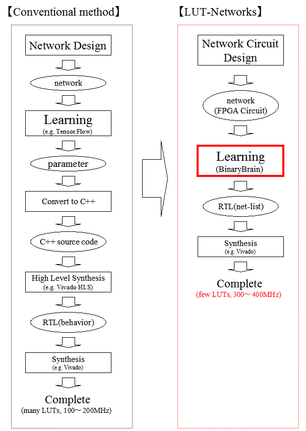
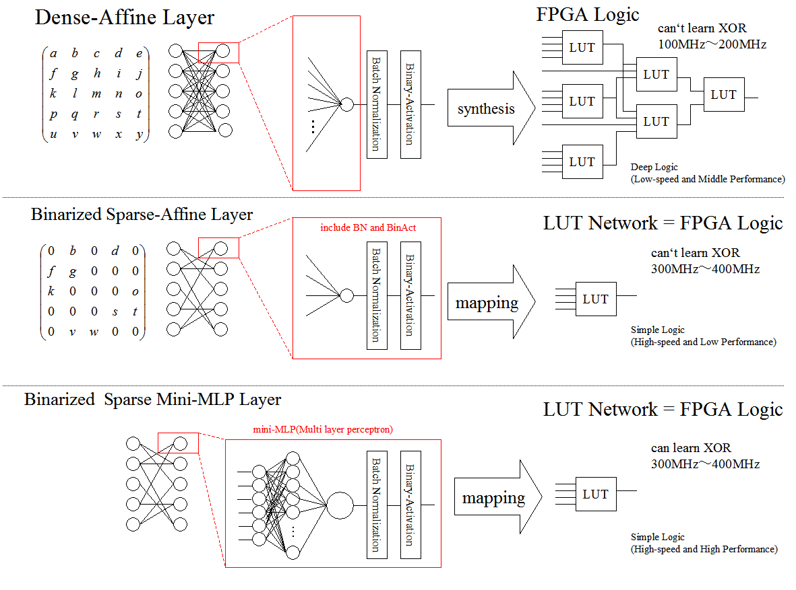
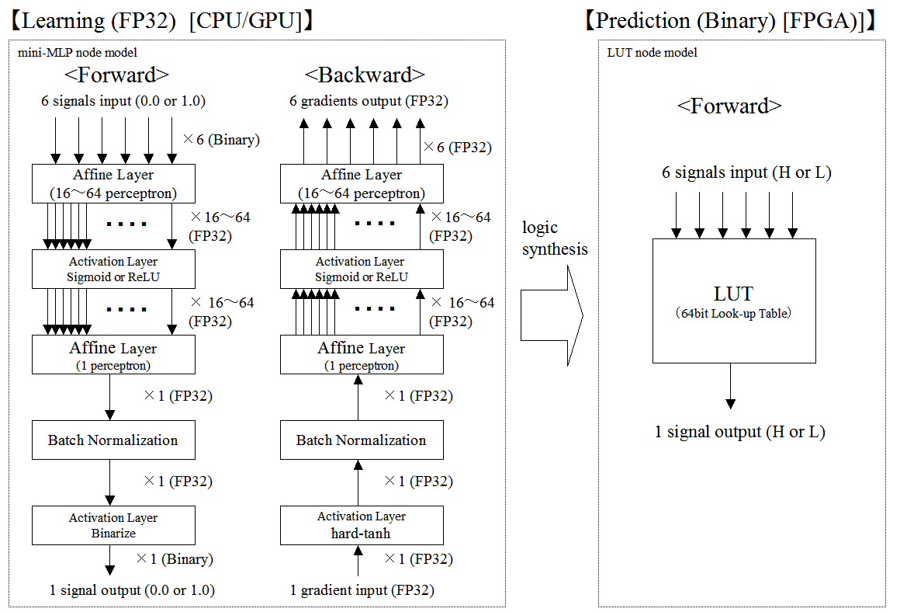
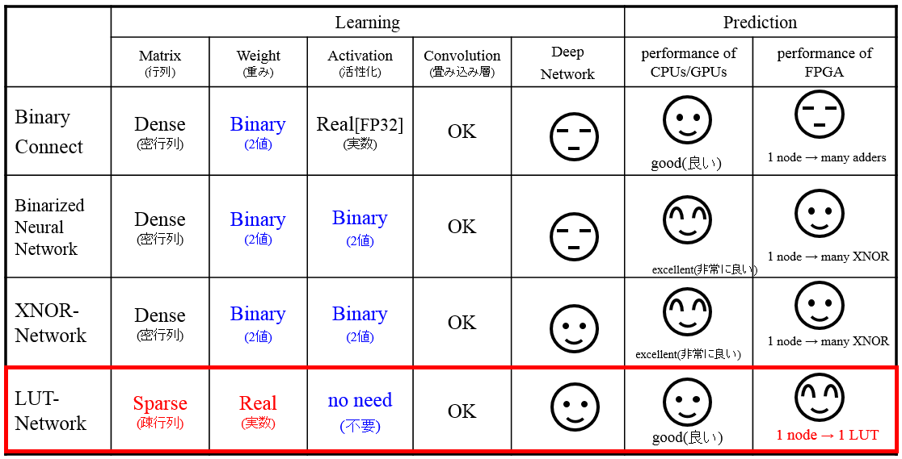


# BinaryBrain  version 2 (version3 comming soon)<br>--binary neural networks platform for LUT-networks<br>
<br>
"ver3_develop" ブランチにて ver3 開発中です
<br>

## 概要
LUT(Look-up Table)ネットワークとはFPGA向けのバイナリ・ディープ・ニューラルネットワークの一種です。
FPGAのLUTを直接学習させることで高いパフォーマンスを実現します。

## MNISTサンプルの動かし方
AXV2以降の命令が使えるCPUと、Windows7以降の環境を想定しております。

### windows
1. install VisualStudio 2015. 
2. git clone --recursive https://github.com/ryuz/BinaryBrain.git 
3. download MNIST from http://yann.lecun.com/exdb/mnist/
4. decompress MNIST for "\sample\mnist"
5. open VC++ solution "sample\mnist\sample_mnist.sln"
6. build "x64 Release"
7. run

### Linux(Ubuntu 18.04.1)
1. install tools 
```
% sudo apt install make
% sudo apt install g++
% sudo apt install clang
% sudo apt install git
```
2. build and run
```
% git clone --recursive https://github.com/ryuz/BinaryBrain.git
% cd BinaryBrain/sample/mnist
% make all
% make run
```

## LUTネットワークとは?
### デザインフロー
FPGA回路はLUTによって構成されています。
このプラットフォームはLUTを直接学習させます。



### 特徴
ソフトウェアの最適化の技法で入力の組み合わせ全てに対して、計算済みの結果を表にしても持たせてしまうテクニックとして、「テーブル化」と呼ばれるものがあります。
また、バイナリネットワークは各レイヤーの入出力が２値化されています。２値化データは例えば0と1の２種で表せるので、例えば32個の入力を持ち、32個の出力を持つレイヤーの場合、32bitで表現可能な4Gbitのテーブルを32個持てば、その間がどんな計算であろうとテーブル化可能です。
4Gbitでは大きすぎますが、テーブルサイズは入力サイズの2のべき乗となるので、例えばこれが6入力程度の小さなものであれば、テーブルサイズは一気に小さくなり、たった64bitのテーブルに収めることが可能です。
そこで、少ない入力数の単位にネットワークを細分化して、小さいテーブルを沢山用意してネットワークを記述しようと言う試みがLUTネットワークです。LUTはルックアップテーブルの略です。
FPGAではハードウェアの素子としてLUTを大量に保有しており、そのテーブルを書き換えることであらゆる回路を実現しています。特にDeep Learningに利用される大規模FPGAは、現在6入力LUTが主流です。
そこで、入力6個のLUT-Networkをディープラーニングの手法で直接学習させることで、GPU向けのネットワークをFPGAに移植するよりも遥かに高い効率で実行できるネットワークが実現可能となります。
実際ディープラーニングに用いられるデータセットを、論理圧縮的なアプローチで損失関数が最小になるようにLUTテーブルとして最適化すると非常に高い効率を示します。
しかしながら、この方法では深いネットワークの最適化が指数関数時間となってしまい、そのままでは深いネットワークは実質的に計算できなくなります。ネットワークを細分化することでこのテクニックを使う手段もありえますが、現在まだその方法は試せておらず、代わりに、LUTに対応するパーセプトロンを使った逆伝播可能なネットワークを定義することで、ある程度の高効率性を保ったまま、深いネットワークを学習させる方法をここに公開しております。
この手法を用いることで、非常に高い効率で、FPGA化可能なネットワークを学習可能です。

### レイヤーモデル
１つのLUTは万能素子なのでXORなどの回路を単独の素子で表現可能です。しかし、パーセプトロンは１つではXORの学習は出来ず、隠れ層を持ったネットワーク構成が必要となります。
その関係を以下に示します。



中間層を有したMLP(多層パーセプトロン)は、誤差逆伝播によりXORなどの複雑な論理も学習できることが知られています。そこで、LUTと等価の表現能力を有するバイナリMLPをMicro-MLPと呼ぶことにします。Micro-MLPは最小で4個の中間層を保持すれば、6次のXORを学習できる可能性を持ちますが、実際に実験を行ったところ、16~64個程度の中間層を持つMicro-MLPであれば、局所解に陥る可能性も低いままLUTの表現範囲を広く学習できることが分かってきました。
この Micro-MLP を束ねて作ったレイヤーをさらに多段に重ねることで、従来のDenseAffineに近い性能のレイヤーを、高パフォーマンスで実現できます。

### LUTモデル
LUTモデルとそれに対応するMicro-MLPの単位の関係を示します。


学習時のモデルを以下に示します。


出力層にバイナリ活性化を置くことで入出力を全て2値化しますが、内部の演算はすべてFP32などの多値で行います。逆伝播も全て多値で行います。

### 従来のバイナリ・ディープ・ニューラル・ネットワークとの違い
従来のバイナリ・ディープ・ニューラル・ネットワークでは、CPU/GPU演算でもっとも課題となる重み係数が2値化されていました。LUTネットワークではこれらは最後にテーブル化されるので学習時はFP32などで計算できます。唯一アクティベーション層でバイナリ化が行われます。




### 性能予測
残念ながらLUT-Networkは学習時はそれほど高速ではありません。またCPU/GPUで予測を実装した場合も速くなりません。FPGA化した場合に驚異的な性能を発揮します。


## ライセンス
現在MITライセンスを採用しています。lisense.txtを参照ください。
ただし、本ソースコードは Eigen や CEREAL を利用しているので、それらに関しては個別に各ライセンスに従ってください。

## 関連資料
以下に本技術をfpgaxで発表した際のスライドを置いております。<br>
https://www.slideshare.net/ryuz88/lut-network-fpgx201902

## 参考
- BinaryConnect: Training Deep Neural Networks with binary weights during propagations<br>
https://arxiv.org/pdf/1511.00363.pdf

- Binarized Neural Networks<br>
https://arxiv.org/abs/1602.02505

- Binarized Neural Networks: Training Deep Neural Networks with Weights and Activations Constrained to +1 or -1<br>
https://arxiv.org/abs/1602.02830

- XNOR-Net: ImageNet Classification Using Binary Convolutional Neural Networks<br>
https://arxiv.org/abs/1603.05279

- Xilinx UltraScale Architecture Configurable Logic Block User Guide<br>
https://japan.xilinx.com/support/documentation/user_guides/ug574-ultrascale-clb.pdf


## 作者情報
渕上 竜司(Ryuji Fuchikami)
- github : https://github.com/ryuz
- blog : http://ryuz.txt-nifty.com
- twitter : https://twitter.com/ryuz88
- facebook : https://www.facebook.com/ryuji.fuchikami
- web-site : http://ryuz.my.coocan.jp/
- e-mail : ryuji.fuchikami@nifty.com

