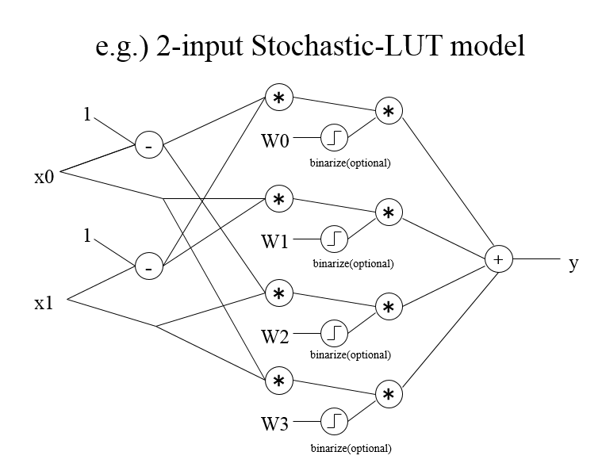


# BinaryBrain Version 3<br> --binary neural networks platform for LUT-networks

## 概要
BinaryBrain は主に当サイトが研究中の LUT(Look-up Table)-Networkを実験することを目的に作成したディープラーニング用のプラットフォームです。
LUT-Networkの評価を目的に作成しておりますが、それ以外の用途にも利用可能です。

以下の特徴があります

- ニューラルネットのFPGA化をメインターゲットにしている
- C++を基本としている
- GPU(CUDA)に対応している
- 量子化＆疎行列のネットワークでパフォーマンスの良い学習が出来る環境を目指している
- SIMD命令やCUDAを使って独自レイヤーを書こうとした際になるべく簡単に書ける事を目指している
- 通常の浮動小数点を使ったモデルも学習も可能として、量子化やスパース化時の効果を条件を揃えて比較検討できるようにする


## MNISTサンプルの動かし方
AXV2以降の命令が使えるCPUと、Windows7以降の環境を想定しております。
CUDA(Kepler以降)にも対応しています。

### windows
1. install VisualStudio 2017 + CUDA 10.1
2. git clone --recursive -b ver3_release https://github.com/ryuz/BinaryBrain.git 
3. download MNIST from http://yann.lecun.com/exdb/mnist/
4. decompress MNIST for "\sample\mnist"
5. open VC++ solution "sample\mnist\sample_mnist.sln"
6. build "x64 Release"
7. run

### Linux(Ubuntu 18.04.1)
1. install tools 
```
% sudo apt update
% sudo apt upgrade
% sudo apt install git
% sudo apt install make
% sudo apt install g++
% sudo apt install nvidia-cuda-toolkit
```
2. build and run
```
% git clone --recursive -b ver3_release  https://github.com/ryuz/BinaryBrain.git
% cd BinaryBrain/sample/mnist
% make
% make dl_mnist
% ./sample-mnist All
```

GPUを使わない場合は make WITH_CUDA=No として下さい。

### Google Colaboratory
nvcc が利用可能な Google Colaboratory でも動作可能なようです。
以下あくまで参考ですが、ランタイムのタイプをGPUに設定した上で
```
!git clone --recursive -b ver3_release  https://github.com/ryuz/BinaryBrain.git
%cd BinaryBrain/sample/mnist
!make all
!make run
```
のような操作で、ビルドして動作させることができます。

## 基本的な使い方
CPU版に関してはヘッダオンリーライブラリとなっているため、include 以下にあるヘッダファイルをインクルードするだけでご利用いただけます。

GPUを使う場合は、ヘッダ読み込みの際に BB_WITH_CUDA マクロを定義した上で、cuda 以下にあるライブラリをビルドした上でリンクする必要があります。

また、BB_WITH_CEREAL マクロを定義すると、途中経過を json 経由で保存可能となります。


## 学習ネットの作り方
順次記述予定ですが、現じてでは基本的にはソースを解読ください。<br>
こちらに手がかり程度に[APIの概要](documents/class.md)を記載しています。


## LUTネットワークとは?
### デザインフロー
FPGA回路はLUTによって構成されています。
このプラットフォームはLUTを直接学習させます。


### 特徴
ソフトウェアの最適化の技法で入力の組み合わせ全てに対して、計算済みの結果を表にしても持たせてしまうテクニックとして、「テーブル化」と呼ばれるものがあります。
また、バイナリネットワークは各レイヤーの入出力が２値化されています。２値化データは例えば0と1の２種で表せるので、例えば32個の入力を持ち、32個の出力を持つレイヤーの場合、32bitで表現可能な4Gbitのテーブルを32個持てば、その間がどんな計算であろうとテーブル化可能です。
4Gbitでは大きすぎますが、テーブルサイズは入力サイズの2のべき乗となるので、例えばこれが6入力程度の小さなものであれば、テーブルサイズは一気に小さくなり、たった64bitのテーブルに収めることが可能です。
そこで、少ない入力数の単位にネットワークを細分化して、小さいテーブルを沢山用意してネットワークを記述しようと言う試みがLUTネットワークです。LUTはルックアップテーブルの略です。
FPGAではハードウェアの素子としてLUTを大量に保有しており、そのテーブルを書き換えることであらゆる回路を実現しています。特にDeep Learningに利用される大規模FPGAは、現在6入力LUTが主流です。
そこで、入力6個のLUT-Networkをディープラーニングの手法で直接学習させることで、GPU向けのネットワークをFPGAに移植するよりも遥かに高い効率で実行できるネットワークが実現可能となります。LUTは単独でXORが表現できるなど、パーセプトロンもモデルよりも高密度な演算が可能です。

### バイナリ変調モデル
BinaryBrainではバイナリ変調したモデルを扱うことを前提としています。
変調を掛けずに普通のバイナリネットワークの学習にBinaryBrainを使うことはもちろん可能ですが、その場合は２値しか扱えないため、回帰問題などの多値のフィッティングが困難になります。
バイナリ変調モデルは下記のとおりです。

特に難しい話ではなくD級アンプ(デジタルアンプ)や、1bit-ADC など、広く使われているバイナリ変調に過ぎません。
バイナリ変調は、量子化を行う代わりに、より高い周波数でオーバーサンプリングすることで、効率的にデジタル回路で多値を扱います。
数学的には、元の多値に従った確率で0と1を取る確率変数に変換して扱うと理解いただければよいかと思います。


### 確率的LUTモデル
BinaryBrainではLUT-Networkを学習させるためにバイナリ確率変数を入力として、バイナリ確率変数を出力するLUTのモデルを利用します。
簡単な説明のために、2入力LUT(テーブルサイズ4個)のモデルを以下に示します。



これは、入力をX0-X1の確率変数とし、バイナリ値が1となる確率を実数値で入力します。
また、W0-W3はルックアップテーブルの各値を示す実数値とします。
そうすると

- W0が引かれる確率 : (1- X1) * (1- X0)
- W1が引かれる確率 : (1- X1) * X0
- W2が引かれる確率 : X1 * (1- X0)
- W3が引かれる確率 : X1 * X0

となるので、出力であるYである確率は、これらにW0-W3の値を乗じたものの和になります。
そしてこの計算ツリーは逆伝播可能であるので、W0-W3を学習させることが出来ます。
結果的に、多値の入力をバイナリ変調した場合に結果を確率的に出力する回路を高パフォーマンスで実現できます。
実際には6入力LUT用の計算式は64個のテーブルを引くために大きなグラフになりますが、この回路で得られた出力はカウンティングして実数値にすることで回帰問題などにも応用できる上、そのままFPGA化することができます。
もちろん、そのまま普通のバイナリネットワークとして利用することも可能です。

確率的LUTモデルを用いることで、後に述べるμMLPのモデルに比べて非常に高速且つ高精度に学習を行うことが可能です。


### μMLPのアイデア
１つのLUTは万能素子なのでXORなどの回路を単独の素子で表現可能です。しかし、パーセプトロンは１つではXORの学習は出来ず、隠れ層を持ったネットワーク構成が必要となります。
その関係を以下に示します。


中間層を有したMLP(多層パーセプトロン)は、誤差逆伝播によりXORなどの複雑な論理も学習できることが知られています。そこで、LUTと等価の表現能力を有するバイナリMLPをMicro-MLPと呼ぶことにします。Micro-MLPは最小で4個の中間層を保持すれば、6次のXORを学習できる可能性を持ちますが、実際に実験を行ったところ、16~64個程度の中間層を持つMicro-MLPであれば、局所解に陥る可能性も低いままLUTの表現範囲を広く学習できることが分かってきました。
この Micro-MLP を束ねて作ったレイヤーをさらに多段に重ねることで、従来のDenseAffineに近い学習性能のレイヤーをバイナリで構築可能です。

### μMLPの LUTモデル
確率的LUTのアイデアにより、必要性は大きく低下したのですが、確率値ではなくバイナリ値のまま学習させるMicro-MLPについて説明します。
Micro-MLPはバイナリ値のまま学習させることができるため、必ずしも確率的に値が扱えないケースや、モデルの検証に役立ちます。
バイナリLUTのモデルとそれに対応するMicro-MLPの単位の関係を示します。


学習時のモデルを以下に示します。


出力層にバイナリ活性化を置くことで入出力を全て2値化しますが、内部の演算はすべてFP32などの多値で行います。逆伝播も全て多値で行います。

### 従来のバイナリ・ディープ・ニューラル・ネットワークとの違い
従来のバイナリ・ディープ・ニューラル・ネットワークでは、CPU/GPU演算でもっとも課題となる重み係数が2値化されていました。LUTネットワークではこれらは最後にテーブル化されるので学習時はFP32などで計算できます。唯一アクティベーション層でバイナリ化が行われます。


### Micro-MLPの 性能予測
残念ながらLUT-Networkは学習時はそれほど高速ではありません。またCPU/GPUで予測を実装した場合も速くなりません。FPGA化した場合に驚異的な性能を発揮します。


## ライセンス
現在MITライセンスを採用しています。lisense.txtを参照ください。
ただし、本ソースコードは CEREAL を利用しているので、それらに関しては個別に各ライセンスに従ってください。

## 参考
- BinaryConnect: Training Deep Neural Networks with binary weights during propagations<br>
https://arxiv.org/pdf/1511.00363.pdf

- Binarized Neural Networks<br>
https://arxiv.org/abs/1602.02505

- Binarized Neural Networks: Training Deep Neural Networks with Weights and Activations Constrained to +1 or -1<br>
https://arxiv.org/abs/1602.02830

- XNOR-Net: ImageNet Classification Using Binary Convolutional Neural Networks<br>
https://arxiv.org/abs/1603.05279

- Xilinx UltraScale Architecture Configurable Logic Block User Guide<br>
https://japan.xilinx.com/support/documentation/user_guides/ug574-ultrascale-clb.pdf


## 作者情報
渕上 竜司(Ryuji Fuchikami)
- github : https://github.com/ryuz
- blog : http://ryuz.txt-nifty.com
- twitter : https://twitter.com/ryuz88
- facebook : https://www.facebook.com/ryuji.fuchikami
- web-site : http://ryuz.my.coocan.jp/
- e-mail : ryuji.fuchikami@nifty.com

