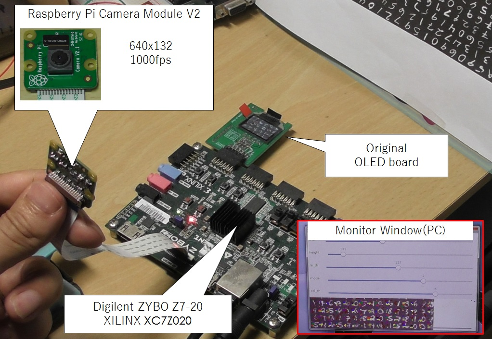
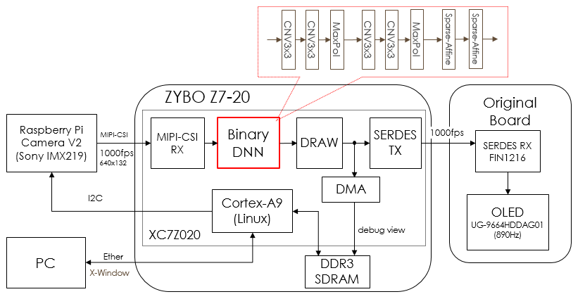
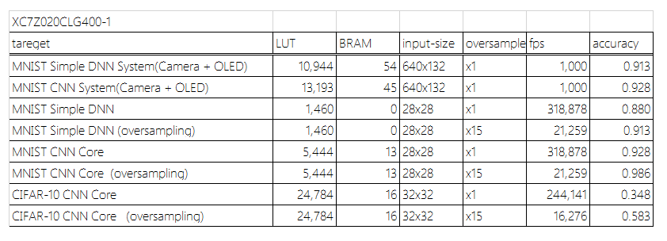
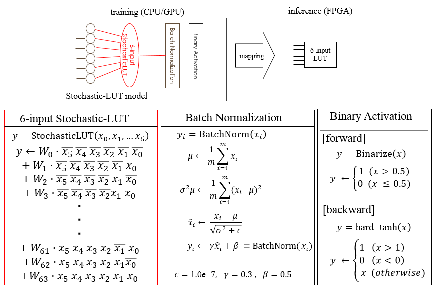
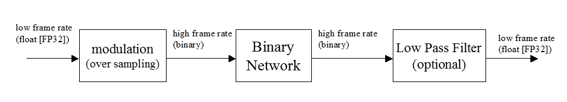

[Japanese version](README.md)

# BinaryBrain Version 4<br> --binary neural networks platform for LUT-networks

[Detailed documentation](https://binarybrain.readthedocs.io/ja/ver4_release/)

## Overview

BinaryBrain is a platform for deep learning. It can train to LUT(Look-up Table)-Network.

This tool enables high-density FPGA training by directly training FPGA LUTs with differentiable circuit descriptions derived from Stochastic calculations.

It has the following features

- The main target is FPGA(field-programmable gate array).
- Differentiable LUT models can be used to directly train LUTs, which are circuit elements in FPGAs.
- Can output source code (Verilog) for small, low latency FPGA circuits.
- Regression analysis is possible though it is binary model.
- You can develop in Python or C++
- Accelerated with GPU (CUDA)


## differentiable circuit description

Under normal circumstances, digital circuits cannot be differentiated because they usually only take values of 0 or 1.

On the other hand, there is an analog method that treats inputs and outputs as "probabilities of being 1" rather than 0 or 1, which is called Stochastic computation.
Fortunately, Neural Networks handle the likelihood of many objects in training, so this approach is a good match.

With Stochastic computation, for example, an AND gate behaves as a multiplier of probabilities, i.e., the probability that both inputs are 1 at the same time. In this way, all digital circuits can be replaced by Stochastic calculations.

The FPGA device is a collection of small memories, called LUTs, and a selection of these memories, which can be rewritten to provide a programmable circuit description. After this LUT circuit is replaced with a differentiable circuit description, the LUT-Network is a network that places the weight coefficients to be learned in the part corresponding to the memory and performs learning.

BinaryBrain is a platform designed to demonstrate the trainability of the LUT-Network.


## Performance

Fully-Binary deep neural network.
1000fps Real-time recognition.





It can be implemented on a FPGA with a small amount of resources.



A unique network model is available.




This technology has also enabled real-time semantic segmentation.

[](https://www.youtube.com/watch?v=f78qxm15XYA)


## How to use MNIST sample program (C++)

Please, read "main.cpp" for usage.

### windows

1. install VisualStudio 2022 + CUDA 12.6
2. git clone --recursive https://github.com/ryuz/BinaryBrain.git 
3. download MNIST from http://yann.lecun.com/exdb/mnist/
4. decompress MNIST for "\samples\cpp\mnist"
5. open VC++ solution "samples\cpp\mnist\sample_mnist.sln"
6. build "x64 Release"
7. run

### Linux(Ubuntu)

1. install CUDA 12.6


2. build and run

```
% git clone --recursive https://github.com/ryuz/BinaryBrain.git
% cd BinaryBrain/samples/cpp/mnist
% make
% make dl_data
% ./sample-mnist All
```

If you don't use GPU, please add "WITH_CUDA=No" option to make.

### Google Colaboratory

Currently you can use nvcc on Google Colaboratory.
Please select GPU runtime.
```
!git clone --recursive https://github.com/ryuz/BinaryBrain.git
%cd BinaryBrain/samples/cpp/mnist
!make all
!make run
```
You can build C++ source code from iPython Notebook.


## How to use MNIST sample program (Python)

### Preparation

Install packeges.

```
% pip install setuptools
% pip install pybind11
% pip install numpy
% pip install tqdm
```

Install [PyTorch](https://pytorch.org)

When using Windows, 64-bit version of VisualStudio is required.
('x64' option is important)

```
> "C:\Program Files (x86)\Microsoft Visual Studio\2019\Community\VC\Auxiliary\Build\vcvarsall.bat" x64
```

### Install with pip

```
% pip install binarybrain
```
### Install with setup.py

```
% # install
% cd python
% python setup.py install --user
```

### Run sample programs (MNIST)

```
% cd samples/python/mnist

% # Simple DNN sample
% python3 MnistDifferentiableLutSimple.py

% # CNN sample
% python3 MnistDifferentiableLutCnn.py
```


### Google Colaboratory

Install and reboot runtime.

```
!pip install pybind11
!git clone --recursive https://github.com/ryuz/BinaryBrain.git
%cd BinaryBrain
!python setup.py install --user
```


## What is LUT networks?

There is also a document on [slideshare](https://www.slideshare.net/ryuz88/lutnetwork-revision2-english-version).

### Design flow

FPGA circuit is constructed from LUTs.
This platform let the LUT's table learn directly.


### Binary modulation model

BinaryBrain can handle binary modulated models.
The binary modulation model is as follows.



For example, PWM(Pulse Width Modulation), delta sigma modulation, and Digital amplifier are also a kind of binary modulation.


### Features

A technique of software optimization that allows you to have a table of computed results for every combination of inputs is called "tabled".
In a binary network, the inputs and outputs of each layer are binary, and binary data can be represented by two kinds of data, 0 and 1, for example, so if a layer has 32 inputs and 32 outputs, for example, you can have 32 tables of 4 Gbit that can be represented by 32 bits, no matter what the calculation is between them. tableable.
Although 4Gbit is too large, the table size is a power of 2 of the input size, so if this is something as small as 6 inputs, for example, the table size will be all the smaller and can be contained in a table of only 64 bits.
LUT stands for look-up table.
FPGAs have a large number of LUTs as hardware elements, and by rewriting these tables, all kinds of circuits can be realized. Large-scale FPGAs, especially those used for Deep Learning, are currently dominated by LUTs with 4 to 6 inputs.

Some may find it strange that the concept of "table lookup" is learned by differentiation and back propagation.

However, the act of table lookup is only a multiplexed selection of memory in terms of circuitry.

Digital circuits are logic circuits such as AND and OR, which can be applied to Stochastic operations such as multiplication.

In order to perform a Stochastic operation, the target of the operation must be a probabilistic one, and the values handled by DeepLearning are
The value handled by DeepLearning is the "plausibility (likelihood)," which is not lost when converted to binary.

BinaryBrain uses a network of 4-6 input LUTs that are trained directly by back propagation, resulting in a network that can run much more efficiently than a GPU network ported to an FPGA. Perceptrons can also perform higher-density operations than models.
Also, if a 2-input LUT is defined, this is simply the basic gate element of a digital LSI, so it could be applied to ASIC design.

### Binary Modulation Model

BinaryBrain can handle binary modulated digital values. It is of course possible to use BinaryBrain for training ordinary binary networks without modulation, but in that case, only binary values can be handled, making multi-level fitting such as regression analysis difficult.
The binary modulation model is as follows.


It is not particularly difficult, but just an application of binary modulation widely used in class-D amplifiers (digital amplifiers), 1-bit-ADCs, and so on.
Although today's digital amplifiers handle binary values internally, they sound beautifully analog when they reach the human ear.

Binary modulation attempts to quantize without degrading the original information in the binary signal by oversampling at a higher frequency when quantizing. Binary networks themselves are trained on the assumption of such binaries, but can achieve great performance on an extremely small circuit scale.
This is the concept of converting and dealing with stochastic variables that take 0s and 1s with probability according to the original multi-valued, which I hope can be understood as giving it Stochasticity.


## License

This source code's license is MIT license.


## ICCE2019(Berlin)
2019 IEEE 9th International Conference on Consumer Electronics (ICCE-Berlin) 
<[slide](https://www.slideshare.net/ryuz88/fast-and-lightweight-binarized-neural-network-implemented-in-an-fpga-using-lutbased-signal-processing-and-its-timedomain-extension-for-multibit-processing)> <[pdf](https://edas.info/p25749#S1569571697)>

https://ieeexplore.ieee.org/document/8966187 


## Author's information

Ryuji Fuchikami

- e-mail : ryuji.fuchikami@nifty.com
- github : https://github.com/ryuz
- web-site : https://rtc-lab.com/
- blog : https://blog.rtc-lab.com/
- X(twitter) : https://x.com/ryuz88/
- facebook : https://www.facebook.com/ryuji.fuchikami/
- linkedin : https://www.linkedin.com/in/ryujifuchikami/


## Reference

- BinaryConnect: Training Deep Neural Networks with binary weights during propagations<br>
https://arxiv.org/pdf/1511.00363.pdf

- Binarized Neural Networks<br>
https://arxiv.org/abs/1602.02505

- Binarized Neural Networks: Training Deep Neural Networks with Weights and Activations Constrained to +1 or -1<br>
https://arxiv.org/abs/1602.02830

- XNOR-Net: ImageNet Classification Using Binary Convolutional Neural Networks<br>
https://arxiv.org/abs/1603.05279

- Xilinx UltraScale Architecture Configurable Logic Block User Guide<br>
https://japan.xilinx.com/support/documentation/user_guides/ug574-ultrascale-clb.pdf

