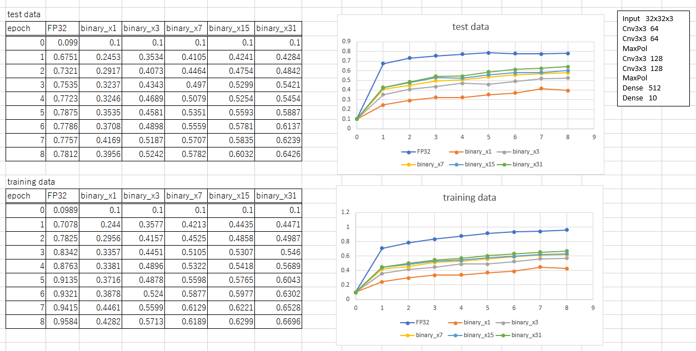

----------------------------------------------
バイナリ変調
----------------------------------------------

概要
-------

本章ではバイナリLUT-Networkに限らず、広くバイナリネットワークに適用可能な技術として、バイナリ変調の適用について述べます。
バイナリ変調とフルバイナリネットワークの組み合わせは、本サイトの提唱する技術の１つであり、入出力のに多値データが
要求される場合にバイナリネットワークを適用するための手法です。

従来のバイナリネットワーク
---------------------------

従来のバイナリネットワークでは、多値画像の認識などを行うために、入力側のいくつかの層をバイナライズせずに
多値入力とすることで多値データを扱っていました。
この方法は一定の効果はあるものの、入力層では乗算器を必要とする為リソースが大きく増加する上に、
出力はバイナリであり、クラスタ分類ぐらいにしか応用できないという課題がありました。

バイナリ変調
-------------------

信号処理の世界にはバイナリ変調という技術があります。
例えばデジタルオーディオなどの分野では 1bit ADC やD級アンプの技術は非常に重要です。
こでは信号をオーバーサンプリングにより、高い周波数の 1bit のデータに量子化することで、
信号処理自体はバイナリで扱うにもかかわらず、入出力データには例えば16bit以上の高品質の
信号を得る技術です。

BinaryBrain では全く同じことをフルバイナリのニューラルネットに行うことで、
非常に小さな回路の認識率を上げたり、Autoencoderや回帰分析などの多値出力を
必要とする分野への適用可能性を広げました。

下記は、通常の Dense CNN の ReLU を Binarizer に置き換え、入力もバイナリ化して
フルバイナリネットワーク化したものを用いて、バイナリ変調の効果を実験した結果です。

binary_x1 が1倍のオーバーサンプル、すなわち何もせずに単純にフルバイナリ化した場合ですが、
FP32での結果に比べて大きく認識率が落ち込みます。
そして、binary_x3、binary_x7, binary_x15, binary_x31 が、それぞれ3倍、7倍、15倍、31倍
のオーバーサンプリングでのバイナリ変調を行ったものですが、ある程度の回復を見せている
事がうかがえます。

同じ回路に、より高いフレームレートで、変調したデータを通すだけなので、スループットは
低下しますが、ネットワークを構成する回路自体のリソースは一切変化することなく、認識率だけが
向上しているのが特徴です。
