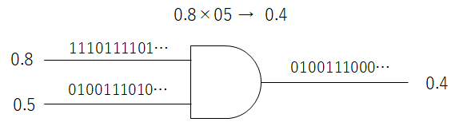
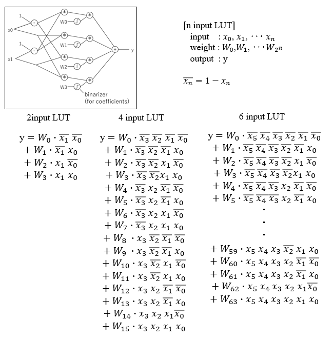
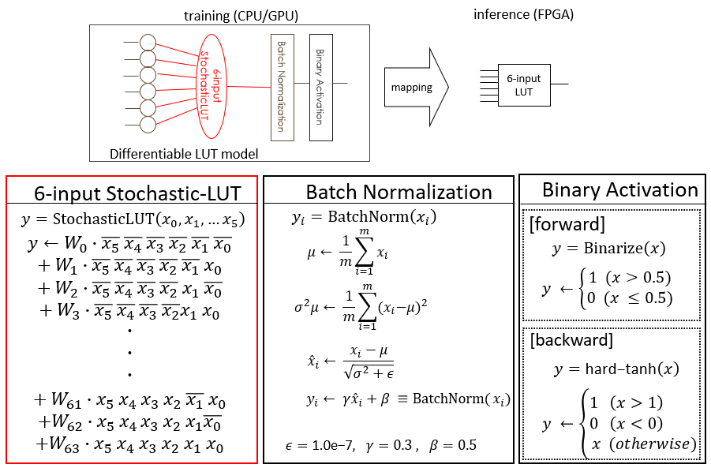
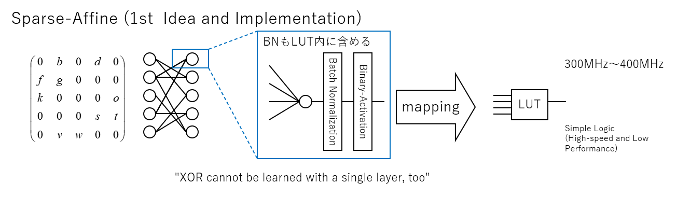
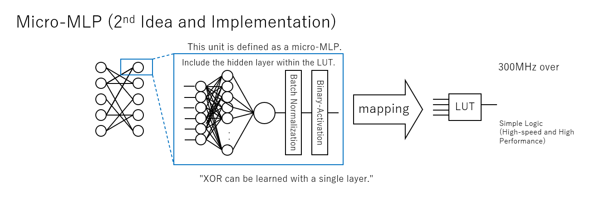
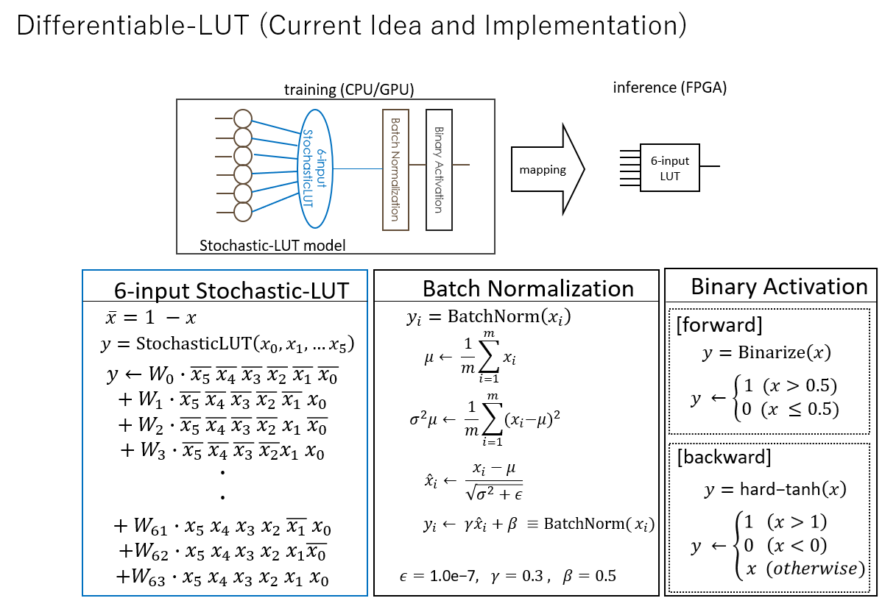

----------------------------------------------
LUT-Network とは
----------------------------------------------

概要
-------

LUT-Networkとは、当サイトの提唱するパーセプトロンモデルの代わりにLUT(ルックアップテーブル)のモデルを利用した
ディープニューラルネットワークのことです。
重みの乗算の代わりにテーブル引きを行うことで、パーセプトロンでは学習することのできない
XORパターンのようなものも柔軟に学習することができます。
乗算を用いない為、低スペックな計算環境でも高速に推論を行うことが可能です。

特にこれをバイナリ化した Binary LUT-Network は、FPGAのLUTに直接変換可能であるため、極めて
高い演算機高率を実現できます。

また以下のバイナリ化の欠点をバイナリ変調技術で克服する方法も提供しています

- ネットワーク部分は入力初段からフルバイナリネットワークを実現可能で高効率
- 出力を多値に戻せるため、回帰分析やAutoEncoderなどのアプリケーションにも適用可能
- FPGAだと１レイヤーの計算が1サイクルで終わるのでナノ秒クラスで認識できる（高リアルタイム性）
- 超廉価＆低消費電力なワンコインFPGAから適用が可能

高価な乗算機アレイが不要となるので、特に電力やリアルタイム性、コストなどが課題となる
エッジコンピューティング分野にちょっとした認識を実現するなどに適したネットワークです。

Differentiable-LUT モデル
---------------------------

LUTによるテーブル参照を誤差逆伝搬で学習させているというと、奇妙に感じられるかもしれません。
一般にデジタル回路はANDやORなどの組み合わせ回路で実現されますので、そのままではこれを
微分して逆伝搬することはできません。
しかしながら機械学習で扱う値は多くの場合は尤度であって、一定の条件下で
デジタル回路はStoachstic演算に置き換えても機能します。
ここに着想を得て、FPGAのLUT回路を微分して、テーブル内を学習可能な構成を得たうえで、
さらになるべく広い条件で利用できるように工夫を要れたものが本モデルとなります。

Stochastic-LUT 演算
^^^^^^^^^^^^^^^^^^^^^^^^

その計算モデルは、LUTのテーブル引きの回路演算を Stoachstic演算に置き換えて実験しているときに発見されました。
Stochastic-LUTモデルは Differentiable-LUT モデルの中にその一部として含まれています。

Stochastic演算とは、確率的な0/1が入力される回路におけるデジタル演算において、その確率値に対して
乗算などの演算子として機能する点に着目したものです。
例えばANDゲートは確率値に対しては乗算器として機能します。

後述しますが、BinaryBrainでは任意のフルバイナリネットワークに対して、バイナリ変調を施したデータを
入出力させながら学習させる機能があり、このバイナリ変調が Stochastic演算を用いたモデルを有効に
機能させるのに役立たせることができます。。

さて、早速ですがLUTも回路的には単なるマルチプレクサですので、一度デジタル回路として考えた後に、
Stoachstic演算に置き換えて考えることで下記のように微分可能な計算で表すことができます。

Wは各ルックアップテーブル内の値に対応し、テーブル内の値が1である確率を表します。
xは入力値が1である確率値であり、yは出力が1となる確率値です。

このモデルを使った学習は、入力同士に相関がなく、純粋に確率値として扱える範疇において、
正しく機能し、出力値が一定の確率で1を出力するようにネットワーク全体を学習させることが
可能です。

内部に備えたWの後にあるBinaeizerをONにして学習すれば、学習完了後にテーブル値は
バイナリに置換することができます。

Differentiable-LUTモデルの全体像
^^^^^^^^^^^^^^^^^^^^^^^^^^^^^^^^^

Stochastic-LUTの計算モデルを活用し、Stochastic性を持たないデータも視野に入れて広く
学習可能にするための疎結合ルックアップテーブル方式のモデルとして、Differentiable-LUTモデルを
提唱しています。

BinaryBrain の備える DifferentiableLUT クラスは下記の３つの使い方に対応しています。

.. image:: ../../images/differentiable_lut_app.png

- Stochastic 値を扱うネットワークを学習可能
- 非バイナリ(FP32など)の疎結合ネットワークで従来のパーセプトロンよりも高性能に機能
- バイナリ疎結合ネットワークでLUTに置換可能なモデルとして学習可能

Differentiable-LUTモデルによるFPGA化
^^^^^^^^^^^^^^^^^^^^^^^^^^^^^^^^^^^^^^^

Differentiable-LUT を、Stochastic演算用や、Fully-Binary 用に利用した場合には、FPGAに
1個に割り当て可能なモデルとして学習させることができます。

特にFully-Binary 用に利用しする場合が広く汎用的に応用可能であり、下記のようなモデルになります。

..   :height: 100px
..   :width: 200px
   :align: left

BinaryBrain における LUT-Network の歴史
---------------------------------------------

現在の Differentiable-LUT モデルに至るまでの、BinaryBrain の開発における LUT-Network の歴史を紹介します。

活性化層をバイナリ化することで、FPGAに適したネットワークが作れますが、従来の全結合層(DenseAffine)を FPGA用に合成すると 下記のように複数の LUT にカスケードされた回路が生成されます。

.. image:: ../../images/dense_affine.png

それに対して、接続数を6に制約するなどの超疎結合なネットワークであれば、下記のように疎結合な LUT が生成されます。しかしこれでは例えば XOR は学習できないなど LUT の表現能力を使いきれません。

そこで中間層を持つ多層パーセプトロンを一つのLUTの学習の為に使う事を思い付き、Micro-MLP(Multi Layer Perceptron)として実装しました。
学習時の計算時間やメモリ消費は大きいものの、このあたりからLUTの性能を活かしたネットアークが作れるようになりました。Micro-MLPのモデルは今も BinaryBrain に含まれています。

そして現在の微分可能(Differentiable)な LUT モデルの着想に至り、Micro-MLP に比べて省メモリで高速な学習が可能になりました。

このように BinaryBrain では、独自の LUT-Network の研究を進めることで、FPGAに適したネットワークを作るための技術を提供しつづけています。
