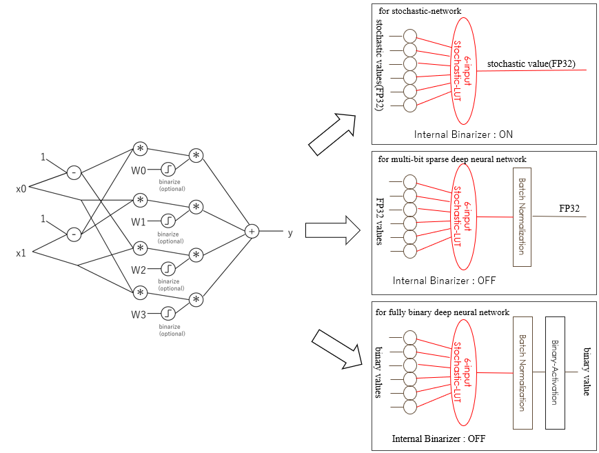

----------------------------------------------
LUT-Networkとは
----------------------------------------------

概要
-------

LUT-Networkとは、当サイトの提唱するパーセプトロンモデルの代わりにLUT(ルックアップテーブル)のモデルを利用した
ディープニューラルネットワークのことです。
重みの乗算の代わりにテーブル引きを行うことで、パーセプトロンでは学習することのできない
XORパターンのようなものも柔軟に学習することができます。
乗算を用いない為、低スペックな計算環境でも高速に推論を行うことが可能です。

特にこれをバイナリ化した Binary LUT-Network は、FPGAのLUTに直接変換可能であるため、極めて
高い演算機高率を実現できます。

また以下のバイナリ化の欠点をバイナリ変調技術で克服する方法も提供しています

- ネットワーク部分は入力初段からフルバイナリネットワークを実現可能で高効率
- 出力を多値に戻せるため、回帰分析やAutoEncoderなどのアプリケーションにも適用可能
- FPGAだと１レイヤーの計算が1サイクルで終わるのでナノ秒クラスで認識できる（超リアルタイム）
- 超廉価＆低消費電力なワンコインFPGAから適用が可能

高価な乗算機アレイが不要となるので、特に電力やリアルタイム性、コストなどが課題となる
エッジコンピューティング分野にちょっとした認識を実現するなどに適したネットワークです。

Sparse-LUTモデル
------------------

LUTによるテーブル参照を誤差逆伝搬で学習させているというと、奇妙に感じられるかもしれません。
驚くことにLUTによるテーブル参照を微分可能なモデルで表現し、これを実現しています。

Stochastic-LUTモデル
^^^^^^^^^^^^^^^^^^^^^^^^

その計算モデルは、LUTのテーブル引きの回路演算を Stoachstic演算に置き換えて実験しているときに発見されました。
Stochastic-LUTモデルはSparse-LUTモデルの中にその一部として含まれています。

Stochastic演算とは、確率的な0/1が入力される回路におけるデジタル演算において、その確率値に対して
乗算などの演算子として機能する点に着目したものです。
例えばANDゲートは確率値に対しては乗算器として機能します。

.. image:: ../../images/stochastic_and.png
   :scale: 100%

後述しますが、BinaryBrainでは任意のフルバイナリネットワークに対して、バイナリ変調を施したデータを
入出力させながら学習させる機能があり、このバイナリ変調がStochastic演算を用いたモデルを有効に
機能させるのに役立たせることができます。。

さて、早速ですがLUTも回路的には単なるマルチプレクサですので、一度デジタル回路として考えた後に、
Stoachstic演算に置き換えて考えることで下記のように微分可能な計算で表すことができます。

.. image:: ../../images/stochastic_lut.png
   :scale: 100%

Wは各ルックアップテーブル内の値に対応し、テーブル内の値が1である確率を表します。
xは入力値が1である確率値であり、yは出力が1となる確率値です。

このモデルを使った学習は、入力同士に相関がなく、純粋に確率値として扱える範疇において、
正しく機能し、出力値が一定の確率で1を出力するようにネットワーク全体を学習させることが
可能です。

内部に備えたWの後にあるBinaeizerをONにして学習すれば、学習完了後にテーブル値は
バイナリに置換することができます。

Sparse-LUTモデルの全体像
^^^^^^^^^^^^^^^^^^^^^^^^^^

Stochastic-LUTの計算モデルを活用し、Stochastic性を持たないデータも視野に入れて広く
学習可能にするための疎結合ルックアップテーブル方式のモデルとして、Sparse-LUTモデルを
提唱しています。

BinaryBrain の備える SparseLUT クラスは下記の３つの使い方に対応しています。

- Stochastic 値を扱うネットワークを学習可能
- 非バイナリ(FP32など)の疎結合ネットワークで従来のパーセプトロンよりも高性能に機能
- バイナリ疎結合ネットワークでLUTに置換可能なモデルとして学習可能

Sparse-LUTモデルによるFPGA化
^^^^^^^^^^^^^^^^^^^^^^^^^^^^^

Sparse-LUT を、Stochastic演算用や、Fully-Binary 用に利用した場合には、FPGAに
1個に割り当て可能なモデルとして学習させることができます。

特にFully-Binary 用に利用しする場合が広く汎用的に応用可能であり、下記のようなモデルになります。

.. image:: ../../images/Sparse-LUT_model.png
   :scale: 100%
..   :height: 100px
..   :width: 200px
   :align: left
